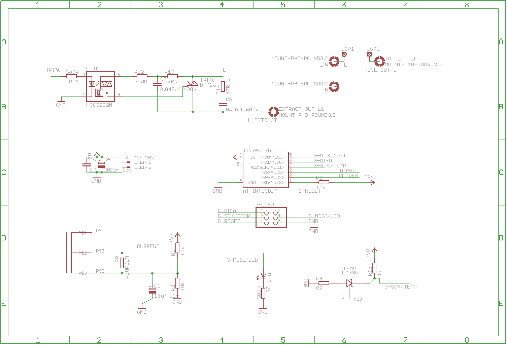
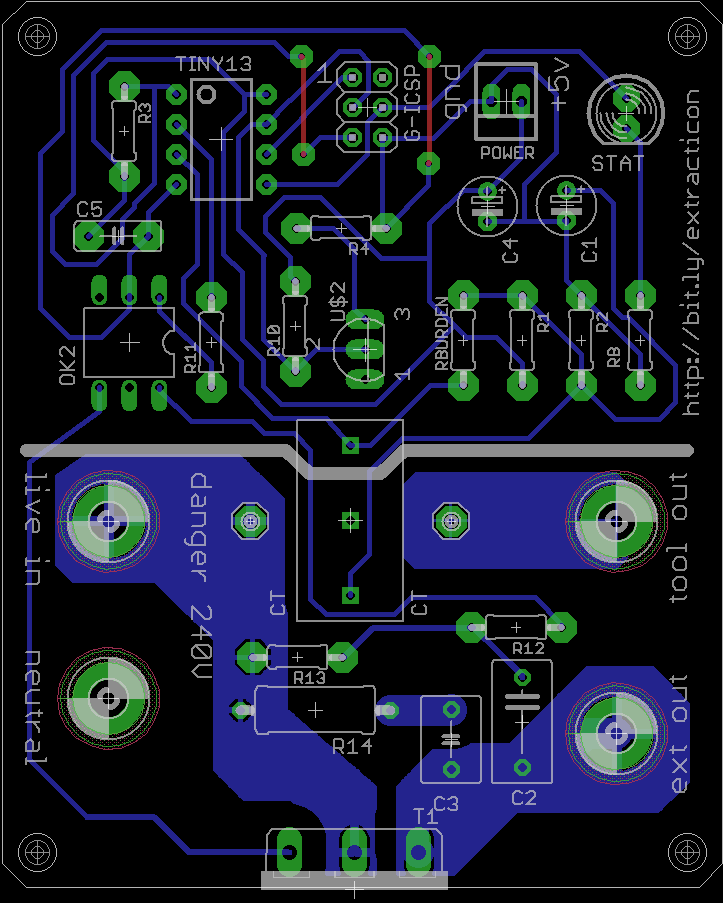
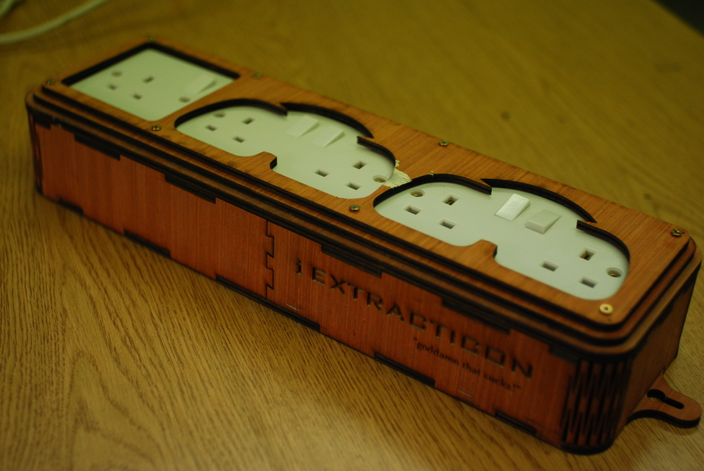
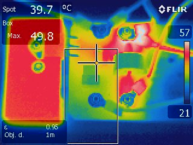

# Extracticon!

* Turns on your extraction automatically when you use an attached tool
* Cheap to build
* 1 sided PCB easy to home fab

# Electronics

# BOM

[BOM](bom.txt)

# Code

[Arduino code for ATTiny45](extracticon_tiny/)

# Images

[More pics](photos/)

# Testing

55C running a 2kw fan heater for 30 minutes. Thermal cutout set to 60.

# Todo

* remove tvalues for pcb production
* bitly link
* sort open hardware logo - look at oshpark email for resolution

# References

* [current sensing](http://openenergymonitor.org/emon/buildingblocks/ct-sensors-interface)
* [using tiny44/45 with arduino](http://highlowtech.org/?p=1695)

# License

This hardware is licensed under the [CERN open hardware license 1.2](http://www.ohwr.org/attachments/2388/cern_ohl_v_1_2.txt), which also included in this repository.
