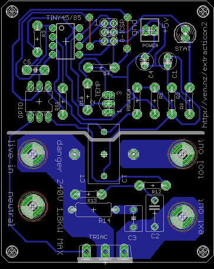

# Extracticon!

* Turns on your extraction automatically when you use an attached tool,
* Cheap to build,
* 1 sided PCB easy to home fab,
* Rated at 1.8KW Max,
* Thermal cutout.

# Photos

[More pics](photos/)

# Electronics

# BOM

[BOM](bom.txt)

* Parts missing from the BOM are standard resistors and LEDs. 
* Ensure caps are at least 6V, preferable 12V.

# Code

[Arduino code for ATTiny45](extracticon_tiny/)

# Testing

* Circuit board is rated for 1.8KW Max.
* Current capacity can be increased by adding solder to the traces.
* We tested 2KW for 30 minutes.

This thermal picture shows maximum of 50C so internal thermal cutout set to 60C.

# Todo

* add CAD files for enclosure

# References

* [This calculator](http://circuitcalculator.com/wordpress/2006/01/31/pcb-trace-width-calculator/) was used to calculate that with 5mm traces we can switch 7.7A or 1.8KW at 240VAC.
* [current sensing](http://openenergymonitor.org/emon/buildingblocks/ct-sensors-interface)
* [using tiny44/45 with arduino](http://highlowtech.org/?p=1695)

# License

This hardware is licensed under the [CERN open hardware license 1.2](http://www.ohwr.org/attachments/2388/cern_ohl_v_1_2.txt), which also included in this repository.
